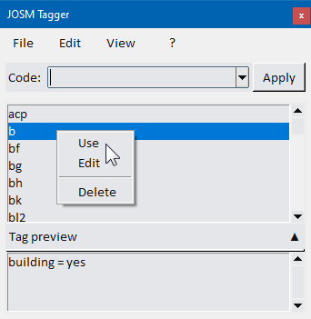

# JOSM Tagger - User Guide

**JOSM Tagger** is a small application designed to speed up OSM (OpenStreetMap) mapping with the JOSM editor. It provides quick tag assignment using mnemonic codes, tag group management, and search capabilities.

---

## Table of Contents

1. [Getting Started](#getting-started)
2. [Launching the Application](#launching-the-application)
3. [Main Window Overview](#main-window-overview)
4. [Using Mnemonic Codes](#using-mnemonic-codes)
5. [Working with Tag Groups](#working-with-tag-groups)
6. [Searching for Tags](#searching-for-tags)
7. [Program Settings](#program-settings)
8. [Keyboard Shortcuts](#keyboard-shortcuts)

---

## Getting Started

### System Requirements
- **Windows**: Windows 10/11 (64-bit)
- **Linux**: Ubuntu 20.04+ / Debian 11+ (or equivalent)
- **JOSM Editor**: Must be installed and running when using the application

## Installation

### <u>Windows</u>
1. Download the `.exe` installer from the releases page
2. Run the installer (it will extract the PyInstaller bundle)
3. Launch **JOSM Tagger.exe** from the Start Menu or desktop shortcut


### <u>Linux</u>
1. Download the `.deb` package from the releases page
2. Install it:
```bash
   sudo dpkg -i josm-tagger.deb
```
   Or use your package manager (GNOME Software, KDE Discover, etc.)
3. Launch **JOSM Tagger** from your applications menu


---

## Launching the Application

### <u>Windows</u>
- **From Start Menu**: Search for "JOSM Tagger"
- **From Desktop**: Double-click the JOSM Tagger shortcut
- **From System Tray**: If minimized, click the icon in the system tray to restore the window

### <u>Linux</u>
- **From Applications Menu**: Open your application launcher and search for "JOSM Tagger"
- **From Terminal**: Run `josm-tagger`
- **From System Tray**: If minimized, click the icon in the system tray to restore the window

**Note**: The application window stays on top of other windows to ensure quick access while mapping.

---

## Quick Overview

### How It Works
1. Use the JOSM Editor to draw or select an object on the map (node, way, relation)

2. With the object(s) selected, switch to JOSM Tagger, either by double-clicking the icon in the system tray or by using the keyboard shortcut (Ctrl-0)
 
3. The main window of Josm Tagger is shown as a small widget, which always stays on top of the other applications:

<p align="center">
  
</p>

4. The Code textbox is immediately activated: type in a mnemonic code (e.g., `hf` for *highway=footway*, `acp` for *access=private*);

5. **Click "Apply"** or press **Enter**; the tag(s) are immediately sent to JOSM and applied to the currently selected object.


### Important: Whatever the Operating system, JOSM must be open and at least one map element must be selected before using the "Apply" function.


### Note
>The way the tags are sent to JOSM is different in Windows and Linux. 
> - In *Windows*, tags are sent to JOSM through User Interface Automation: Josm Tagger emulates the user's clicks and commands in JOSM, e.g. by "pressing" *Ctrl-A* to recall the tag insertion form, *Tab* to switch among the form fields, *Enter* to confirm). 
>
>- In *Linux*, Josm Tagger communicates with the Editor through the *Remote Control* interface. For this reason, the Remote Control function in JOSM must be enabled in JOSM (Edit >> Preferences >> Remote control >> Enable Remote Control )

Each method has its up and down sides: while GUI automation doesn't need particular settings, it's slower and requires that user not to interact with the keyboard/mouse while the tags are being applied; on the other side, Remote control is faster but requires additional configuration and user permissions to work.


## Mnemonic Code Input
In JOSM Tagger, one or more OSM tags can be assigned to a short mnemonic code, which can be quickly recalled by typing its name.

#### The Code text box
- Enter a mnemonic code (e.g., `hf` for *highway=footway*, `acp` for *access=private*)
- Click the ***"Apply"*** button or press *Enter* to send the tag to the currently selected object in JOSM


**Example 1**: Type ***`hf`*** and click *Apply* (or press Enter)
> the tag is applied to the currently selected object in JOSM:
> `highway=footway`

**Example 2**: Type ***`pser`*** and click *Apply* 
> The tags are sent to JOSM:<br>
> `highway=service`<br>
> `access=private`

<br>

---

#### Available codes
1) - As you type the first characters, the list of available codes, in the middle part of the main window, will show the ones that begin with the entered characters; 

<p align="center">
  
</p>

- Hover the mouse cursor above one of them to get a preview of the associated tags; 

- Click any code in the list to display the tags in the *Tag preview* section.

- Double-click a code in the list to immediately send it to JOSM.

- Right-click a code in the list to show a context menu. Two options are available from there:

> 1. ***Use*** --> Send the code to the main textbox;
> 2. ***Edit*** -> Send the code to the Tag Editor form, where you can modify it.

<p align="center">
  
</p>


### Common Mnemonic Codes (Examples)

| Code | Expands To | Use Case |
| --- | --- | --- |
| `acp` | `access=private` | Mark as private access |
| `b` | `building=yes` | Mark a generic building |
| `bf` | `barrier=fence` | Add a fence barrier |
| `bg` | `barrier=gate` | Add a gate barrier |
| `bh` | `barrier=hedge` | Add a hedge barrier |
| `hcr` | `highway=crossing` | Mark a pedestrian crossing |
| `pser` | `highway=service, access=private` | Add a private driveway |
| `tuc` | `tunnel=culvert, layer=-1` | Mark a culvert |

**Complete list**: All available codes are stored locally and can be browsed using the **Search** dialog (see below).

---

## Working with Tag Groups

Tag Groups allow you to apply multiple related tags at once by typing the corresponding mnemonic code.

### Selecting a Tag Group

1. Click the **Tag Groups dropdown** in the main window
2. Select a group from the list (e.g., "Building basics", "Road properties")
3. A description or list of tags is shown
4. Click **"Apply Group"** to send all tags to JOSM

### Creating a New Tag Group

1. Click the **Settings button** (gear icon)
2. Go to the **"Tag Groups"** tab
3. Click **"New Group"**
4. Enter a group name (e.g., "My Building Tags")
5. Click **"Add Code to Group"** to select which codes to include
6. Drag codes to reorder them if needed
7. Click **Save** to confirm

### Editing an Existing Tag Group

1. Open **Settings → Tag Groups**
2. Select the group from the list
3. Click **"Edit Group"**
4. Add or remove codes using the interface
5. Click **Save** to confirm changes

### Deleting a Tag Group

1. Open **Settings → Tag Groups**
2. Select the group you want to delete
3. Click **"Delete Group"**
4. Confirm the deletion

---

## Searching for Tags

The Search function helps you find mnemonic codes that contain specific tag keys or values.

### Opening the Search Dialog

1. Click the **Search button** in the main window
2. Or press **Ctrl+F** (if configured in settings)

### Searching by Tag Key

1. Enter a **search term** in the search field (e.g., `highway`)
2. All codes that include a tag with the key `highway` will be listed

**Example**: Search for `highway`
- Results show: `hw` (highway=road), `hwres` (highway=residential), etc.

### Searching by Tag Value

1. Enter a **search term** in the search field (e.g., `private`)
2. Search results show codes where any tag value contains `private`

**Example**: Search for `private`
- Results show: `acp` (access=private), `pvt` (private=yes), etc.

### Using Search Results

1. Click on a code in the search results
2. The code and its tags are displayed
3. Click **"Apply"** to send the tag to JOSM
4. Or copy the code to your clipboard for later use

---

## Program Settings

Access settings by clicking the **Settings button** (gear icon) in the main window.

### General Tab

#### Font Selection
- **Font Family**: Choose your preferred font (Arial, Calibri, etc.)
- **Font Size**: Adjust text size (useful for high-DPI displays)
- **UI Scale**: Scale the entire interface (useful if text is too small)

#### JOSM Window Detection
- **JOSM Window Title**: The application searches for the JOSM window using this title
- Default: `Java OpenStreetMap Editor`
- If JOSM isn't detected, try checking the actual JOSM window title in your system

### Theme Tab (Appearance)

#### Light Theme
- **Background Color**: Choose the main window background color
- **Panel Color**: Color for panels and buttons
- **Text Color**: Foreground text color

#### Dark Theme
- **Background Color**: Main window background in dark mode
- **Panel Color**: Panel/button color
- **Text Color**: Text color in dark mode

#### Enable Dark Theme
- Toggle the dark theme on or off
- Changes apply immediately

#### Background Picture
- **Load Image**: Set a background image for the main window
- **Remove Image**: Clear the background picture
- Useful for custom branding or visibility in bright environments

### Hotkey Tab

#### Global Hotkey Activation
- **Hotkey**: Set a keyboard shortcut to show/hide the JOSM Tagger window
- **Default**: Usually Alt+T or similar (platform-dependent)
- Useful when JOSM is fullscreen or you need quick access

**Note on Linux**: Global hotkeys work best on X11 sessions. If using Wayland, hotkey support may be limited.

### Tag Groups Tab
(See [Working with Tag Groups](#working-with-tag-groups) above)

---

## Keyboard Shortcuts

### Global Shortcuts (Work Anywhere)

| Shortcut | Function | Platform |
| --- | --- | --- |
| **Alt+T** | Show/Hide JOSM Tagger window | Windows, Linux |
| **Ctrl+F** | Open Search dialog | Windows, Linux |

### Main Window Shortcuts

| Shortcut | Function |
| --- | --- |
| **Ctrl+Enter** | Apply the current mnemonic code |
| **Tab** | Switch between input fields |
| **Escape** | Clear the mnemonic code field |
| **Alt+S** | Open Settings |
| **Alt+H** | Open Help / About |

### Search Window Shortcuts

| Shortcut | Function |
| --- | --- |
| **Enter** | Apply the selected code from search results |
| **Escape** | Close the search window |
| **Ctrl+C** | Copy the selected code to clipboard |

---

## Troubleshooting

### JOSM Window Not Found
**Problem**: "JOSM window not found" error when clicking Apply

**Solution**:
1. Make sure JOSM is open and has the window title `Java OpenStreetMap Editor`
2. Check if JOSM's window title has changed (especially if using extensions)
3. In Settings → General, verify the JOSM Window Title matches
4. Try focusing the JOSM window before applying tags

### Hotkey Not Working (Especially on Linux)
**Problem**: Global hotkey doesn't respond

**Possible Causes**:
- Running on Wayland instead of X11 (Wayland has limited hotkey support)
- Another application is using the same hotkey
- Permissions issue

**Solutions**:
- On Linux, ensure you're using an X11 session (check `echo $XDG_SESSION_TYPE`)
- Change the hotkey to something less common
- Try running JOSM Tagger with elevated permissions (sudo)

### Tags Not Applied to JOSM
**Problem**: Tags appear in JOSM Tagger but don't show in JOSM

**Solution**:
1. Ensure an object is **selected in JOSM** before clicking Apply
2. Make sure JOSM is the active window (in focus)
3. Check that the JOSM window hasn't been renamed or minimized to tray
4. Restart JOSM and JOSM Tagger

### Application Crashes on Linux
**Problem**: Application exits unexpectedly

**Possible Causes**:
- Missing system dependencies (tkinter, GTK libraries)

**Solution**:
```bash
sudo apt update
sudo apt install -y python3-tk libcanberra-gtk-module libcanberra-gtk3-module
```

---

## Tips & Best Practices

### Productivity Tips
- **Use tag groups for complex objects**: For buildings, create a group with common keys (building=*, height, levels, material)
- **Create custom groups per mapping session**: Organize codes by the type of objects you're mapping that session
- **Combine with JOSM presets**: Use JOSM presets for complex tagging, JOSM Tagger for quick single tags

### Organizing Your Codes
- **Naming convention**: Use codes that are easy to remember:
  - `hw` for highway tags
  - `acp` for access=private
  - Avoid very short codes that clash with other codes
  
### Window Management
- **Minimize to tray**: Close the main window to minimize it to the system tray (hotkey brings it back)
- **Stay on top**: The window always stays on top of other applications for quick access

### Backup Your Configuration
- **config.json**: Contains all your settings, groups, and preferences
- **codes.json**: Contains all your mnemonic code definitions
- **Location**:
  - Windows: `%AppData%\Local\JOSM_Tagger\`
  - Linux: `~/.config/josm_tagger/` (or check the app directory)
- Periodically backup these files to safely move your setup to another machine

---

## Frequently Asked Questions

**Q: Can I edit the mnemonic codes?**  
A: Currently, code definitions come from `codes.json`. Advanced users can edit this file directly (requires restart), but a GUI editor for codes is planned for a future version.

**Q: Can I use JOSM Tagger with remote JOSM servers?**  
A: No, JOSM Tagger interacts with the local JOSM application only. Remote sessions are not supported.

**Q: Can I use multiple tag groups at once?**  
A: You must apply groups one at a time. However, you can create composite groups that combine multiple groups' tags.

**Q: Is there a mobile/web version?**  
A: Not currently. JOSM Tagger is a desktop application for Windows and Linux.

**Q: How do I uninstall JOSM Tagger?**  
- **Windows**: Settings → Apps → Find "JOSM Tagger" → Uninstall
- **Linux**: `sudo apt remove josm-tagger` or use your package manager

---

## Getting Help

- **Report Bugs**: Visit the project repository and open an issue
- **Suggestions**: Feature requests are welcome in the issue tracker
- **Configuration Help**: Check `config.json` documentation in the project README

---

## Version Information

- **Current Version**: 0.1.11
- **Author**: Max1234-ITA, 2026
- **License**: See LICENSE file in the project repository

---

**Last Updated**: May 2026  
**For the latest version and updates, visit the project repository.**

