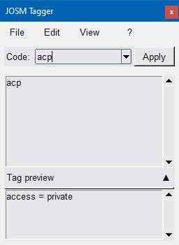

 

<h1 style="display:inline-block; margin-left:10px;">
JOSM-...What?!?</h1>

If you like mapping on OpenStreetMap and use **JOSM**, perhaps you find yourself having to frequently apply groups of tags in a recurring way, such as *highway=service* with *access=private*, or *tunnel=culvert* and *layer=-1*)

---

## *The problem... to me, at least*
It happens to me very often, and every time I feel myself slown down by the editor's User Interface slows, despite I use keyboard shortcuts: 
 - Open the insert window with *Alt-A*, type the key (or part of it and wait for autocompletion), *Tab *to move to the next textbox, insert the value (or part of it and wait again for autocompletion), *Enter* to confirm (or *Shift-Enter* to apply and keep the window open) and so on... it's a frustrating task!

 - Defining presets is also useful but not very fast: once the presets are created, I still have to look for the one I want and select it.

 - Copy an existing object and paste only the tags with *Shift-Ctrl-V*? Yes, of course, but it speeds up my mapping just for the copied element.

 - Repeat the last operation with *Shift-R*? As above, it only works if the last item selected is the one I'm interested in.

---

## *The solution... to me again, at least*

I then asked myself: "why can't I activate a window with a hotkey andlike if it was command line interface, recall a group of predefined tags, identifying them with a mnemonic code I can easily remember and quickly type?"

 

For this reason, I created **JOSM Tagger**: 

  

Once the program starts, I can call the main window by pressing Ctrl-0 and immediately type the code corresponding to the tag (or group of tags) I want to insert. 
To confirm, just press Enter and JOSM Tagger will do the rest: all it takes is for JOSM to select at least one object to apply the tags to.

Of course, the program doesn't allow you to apply only the tag groups I've defined for my needs; you can also create new ones and modify existing ones, and if you want to know if a group with the desired tags already exists, there's also a tool to search for the keys and values you're interested in.

---

## *And now... "à vous!" (if you like, of course)*
Now that "on my computer" everything seems to work fine,  it's time to share it; Hope it will help you too!

Max

 

---

 

## Disclaimer

This program is distributed "as-is". It was developed in Windows andall the described features *should* work as described.

A Linux version is also available: it should work too, but there's some restriction, as the hotkey might not work, depending on the graphic environment:

 - On X11/Xorg: hotkey should work as intended
 - On Wayland: Most probably the hotkey won't work due to environment-dependent restrictions. If this is your case, you can try emulating a X11 session or use Josm Tagger without hotkey.
 
---

## Some nerdy facts :-)

- Josm Tagger is written in Python 3 (3.12-3.14), with some help from several AI engines (mainly Codex by OpenAI)

- Developing the core feature (sending specified tags to JOSM) took just a couple of hours in February 2026, thanks to the AI contribution in building up the whole main form layout and transmission/control routines

- Making everything work as I wished, with proper logics and without critical glitches, took about four months... thanks to the AI stupidity (seriously, don't expect miracles from those engines)... OK, I worked on this project during my spare time, in the weekends, etc., that's still a huge time respect to the amount I dedicated to the core feature.

- The worst AI engine that participated in this project is ChatGPT.  

- The AI Engine that fixed most of the bugs in this project was Codex: it has very good code analysis capabilities an can provide a working solution in a reasonable time.  

- How about GitHub Copilot? It participated too, of course! I found it quite good at creating form layouts starting from mockup pictures, but when it came to generating the code behind the controls, it started losing the overall view and increasing the level of Entropy, instead of reducing it.