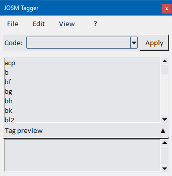
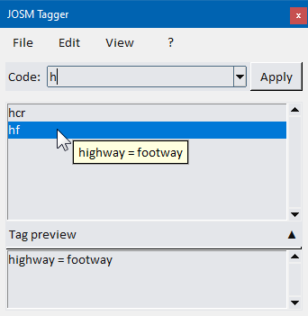
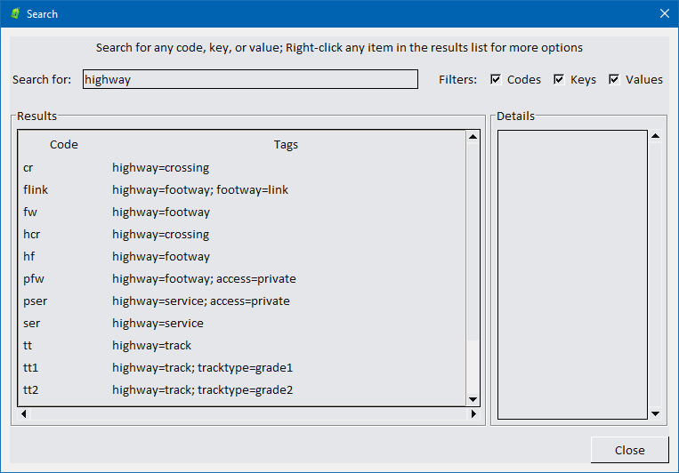
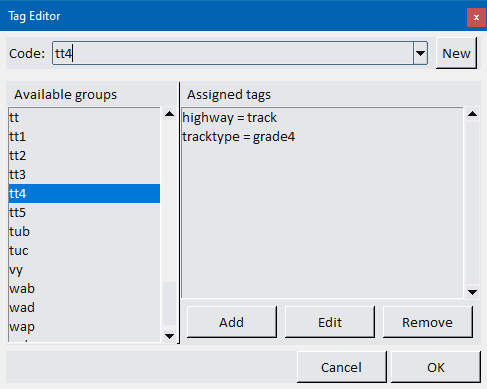
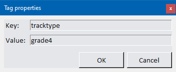
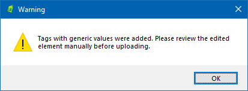
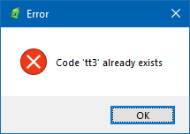
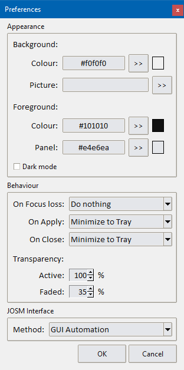

# JOSM Tagger - User Guide

**JOSM Tagger** is a small application designed to speed up OSM (OpenStreetMap) mapping with the JOSM editor. It provides quick tag assignment using mnemonic codes, tag group management, and search capabilities.

---

## Table of Contents

1. [Getting Started](#getting-started)
2. [Launching the Application](#launching-the-application)
3. [Main Window Overview](#main-window-overview)
4. [Using Mnemonic Codes](#using-mnemonic-codes)
5. [Working with Tag Groups](#working-with-tag-groups)
6. [Searching for Tags](#searching-for-tags)
7. [Program Settings](#program-settings)
8. [Keyboard Shortcuts](#keyboard-shortcuts)

---

## Getting Started

### System Requirements
- **Windows**: Windows 10/11 (64-bit)
- **Linux**: Ubuntu 20.04+ / Debian 11+ (or equivalent)
- **JOSM Editor**: Must be installed and running when using the application

## Installation

### <u>Windows</u>
1. Download the `.exe` installer from the releases page
2. Run the installer (it will extract the PyInstaller bundle)
3. Launch **JOSM Tagger.exe** from the Start Menu or desktop shortcut


### <u>Linux</u>
1. Download the `.deb` package from the releases page
2. Install it:
```bash
   sudo dpkg -i josm-tagger.deb
```
   Or use your package manager (GNOME Software, KDE Discover, etc.)
3. Launch **JOSM Tagger** from your applications menu


---

## Launching the Application

### <u>Windows</u>
- **From Start Menu**: Search for "JOSM Tagger"
- **From Desktop**: Double-click the JOSM Tagger shortcut
- **From System Tray**: If minimized, click the icon in the system tray to restore the window

### <u>Linux</u>
- **From Applications Menu**: Open your application launcher and search for "JOSM Tagger"
- **From Terminal**: Run `josm-tagger`
- **From System Tray**: If minimized, click the icon in the system tray to restore the window

**Note**: The application window stays on top of other windows to ensure quick access while mapping.

---

## Quick Overview

### How It Works
1. In JOSM Editor, draw or select amap element (node, way, relation);

2. Switch to JOSM Tagger, either by double-clicking the icon in the system tray or by using the keyboard shortcut (Ctrl-0)
 
3. Josm Tagger is shown as a small widget, which always stays on top of the other applications:

<p align="center">
  
</p>

4. The Code textbox is already active: just type in a mnemonic code (e.g., `hf` for *highway=footway*, `acp` for *access=private*);

5. **Click "Apply"** or press **Enter**; the tag(s) are immediately sent to JOSM and applied to the currently selected object.


### Important: Whatever the Operating system, JOSM must be open and at least one map element selected before using the "Apply" function.


## Tag groups
In JOSM Tagger, one or more OSM tags can be grouped under a short mnemonic code, which can be quickly recalled by typing its name.
#### The *Code* text box
This control is used to select which group of tags will be applied to the selected object(s) in JOSM.

 1) Select the textbox and type any mnemonic code among the ones available (listed in the middle part of the main window), e.g., *`hf`* for *highway=footway*, or *`acp`* for *access=private*.

As you type the first characters, the code list will show the ones that begin with the entered characters; 

<p align="center">
  
</p>

 2. Click the ***"Apply"*** button or press *Enter* to apply the tag(s) to the currently selected object in JOSM


> **Example 1**: Type ***`hf`*** and click *Apply* (or press Enter)
> the tag is applied to the currently selected object in JOSM:
> `highway=footway`

> **Example 2**: Type ***`pser`*** and click *Apply* 
> The tags are sent to JOSM:<br>
> `highway=service`<br>
> `access=private`

<br>

---

#### Available tag groups
The list in the middle part of the window can be browsed to see which tags groups are presente and the tags assigned to them.

- Hover the mouse cursor above one of them to get a preview of the associated tags; 

- Click any code in the list to display the tags in the *Tag preview* section.

- Right-click a code in the list to show a context menu. Two options are available from there:

- Double-click a code in the list to immediately send it to JOSM.


> 1. ***Use*** --> Send the code to the main textbox;
> 2. ***Edit*** -> Send the code to the Tag Editor form, where you can modify it.

<p align="center">
  
</p>


### Common Codes (Examples)

| Code | Expands To | Use Case |
| --- | --- | --- |
| `acp` | `access=private` | Mark as private access |
| `b` | `building=yes` | Mark a generic building |
| `bf` | `barrier=fence` | Add a fence barrier |
| `bg` | `barrier=gate` | Add a gate barrier |
| `bh` | `barrier=hedge` | Add a hedge barrier |
| `hcr` | `highway=crossing` | Mark a pedestrian crossing |
| `pser` | `highway=service, access=private` | Add a private driveway |
| `tuc` | `tunnel=culvert, layer=-1` | Mark a culvert |

**Complete list**: all available codes are stored locally and can be browsed using the **Search** dialog (see below).

---

## Searching for Tags

Need to know which groups contain a particular tag? The ***Search*** function comes to help!


1. In the main window, select `Edit >> Search`, or just press **Ctrl+F**:

2. Type any term in the search field (e.g., `highway`);

3. All groups that include a tag with the entered key will be listed;

4. The results can be refined by limiting the search to codes, key or values in the *Filters* section (select the corresponding checkboxes to enable, deselect to disable)


<p align="center">
  
</p>


### Using the search results

1. <u>Click</u> any code in the search results to show its details in the right part of thew window;

2. <u>Double-click</u> to load it into the main widow, redy to be applied;

3. <u>Right-click</u> to display a context menu which offers two options:

	1. ***Use***: loads the code into the main window, for later use;

	2. ***Edit***: Opens the *Tag Editor*, where it can be modified or deleted.


---


## Creating and modifying Tag Groups

The existing groups can be modified or deleted if not needed; You also can create new ones to suit particular needs.


### The Tag Editor

In the main window, select `Edit >> Tag groups`: this will bring the *Tag editor* window up.

<p align="center">
  
</p>

#### Editing existing groups

1. Type a mnemonic into the *Code* textbox, and/or select it from the *Available codes* list  

2. Review the tags currently belonging to that group in the *Assigned tags* section; select the one you wish to modify

  - Click the ***[ Edit ]*** button to change the tag key and value:

<p align="center">
  
</p>

   - Click the ***[ Remove ]*** button to delete the tag  
   
 > **IMPORTANT** - The tag deletion cannot be undone!    
 
   - Click the ***[ Add ]*** button to assign a new tag to the selected group


#### Tags with "generic values"
Sometimes it can be useful to add a tag with a generic value to an element on the map, to be modified later.

In this case, a value such as `...`, or `###` (or any other string containing the same character repeated 3 times or more) can be assigned to that tag.

> **Example**: Group *nn* will expand into the tags:
> `addr:street=......`<br>
> `addr:housenumber=......`

Josm Tagger will detect the "generic" value when applying the tag group, and will display a warning message:

<p align="center">
  
</p>

> **IMPORTANT**: such generic tag values values MUST NOT be uploaded to the OpenStreetMap database! 
>Please <u>use this function carefully</u> and always take some time to review your edits and the warnings thrown by JOSM at upload time.


#### Creating a new group

1. Click the ***[ New ]*** button

2. Enter a name tor the new group (perhaps a short one, which can be easily remembered and typed).  

> **NOTE**: The group name must be unique, otherwise an error message is displayed.

<p align="center">
  
</p>

3. Add one or more tags to the new group, as shown above.


### Deleting a Tag Group

1. Right click the desired name in the *Available groups* list;
2. Choose ***Delete*** from the context menu.


### Renaming a Tag Group

1. Right click the desired name in the *Available groups* list;
2. Choose ***Rename*** from the context menu.

---


## Program Settings

This menu allows some customization to the program's interface and behaviour.
To open it, from the main window select `Edit >> Preferences`:

<p align="center">
  
</p>

### Appearance
Here some graphics elements of the program can be configured (background and foreground colour, DArk MOde, etc.)

### Behaviour
This section contains options which control the program's reaction to particular events (when losing focus, when applying tags, when closed by clicking the 'x' button in the window corner)


### JOSM interface

JOSM Tagger has two possible ways to send the tags to JOSM:
- ***User Interface Automation***: the program emulates user's clicks and keyboard commands in JOSM, e.g. by "pressing" *Ctrl-A* to recall the tag insertion form, *Tab* to switch among the form fields, *Enter* to confirm). 

- ***Remote Control***: tags are sent to JOSM through *http* protocol. In order for this method to work, the *Remote Control* feature must be enabled in JOSM (`Edit >> Preferences >> Remote control >> Enable Remote Control` ): this will cause the Editor to listen for connections on standard TCP port 8111.

Each method has its up and down sides: *GUI automation* doesn't need particular settings but is slower and requires that the user does not interact with the keyboard or mouse while the tags are being applied; on the other side, *Remote control* is faster but requires additional configuration and -in some cases- user permissions to work.

> **NOTE**: On Linux systems,the only available option is Remote Control.

---

## Application font
The font style and size can be customized by selecting `View >> Font`. Set the desired options, the click [ Apply ] to confirm your choice.

---


## Global Hotkey Activation

Josm Tagger is configured to automatically bring up its main window if the Ctrl-0 hotkey is detected.

> **NOTE**: on Linux, global hotkeys work best on X11 sessions. If using Wayland, hotkey support may be limited.


---

## Troubleshooting

### JOSM Window Not Found
**Problem**: "JOSM window not found" error when clicking Apply

**Solution**:
1. Make sure JOSM is open and has the window title `Java OpenStreetMap Editor`
2. Check if JOSM's window title has changed (especially if using extensions)
3. In Settings → General, verify the JOSM Window Title matches
4. Try focusing the JOSM window before applying tags

### Hotkey Not Working (Especially on Linux)
**Problem**: Global hotkey doesn't respond

**Possible Causes**:
- Running on Wayland instead of X11 (Wayland has limited hotkey support)
- Another application is using the same hotkey
- Permissions issue

**Solutions**:
- On Linux, ensure you're using an X11 session (check `echo $XDG_SESSION_TYPE`)
- Change the hotkey to something less common
- Try running JOSM Tagger with elevated permissions (sudo)

### Tags Not Applied to JOSM
**Problem**: Tags appear in JOSM Tagger but don't show in JOSM

**Solution**:
1. Ensure an object is **selected in JOSM** before clicking Apply
2. Make sure JOSM is the active window (in focus)
3. Check that the JOSM window hasn't been renamed or minimized to tray
4. Restart JOSM and JOSM Tagger

### Application Crashes on Linux
**Problem**: Application exits unexpectedly

**Possible Causes**:
- Missing system dependencies (tkinter, GTK libraries)

**Solution**:
```bash
sudo apt update
sudo apt install -y python3-tk libcanberra-gtk-module libcanberra-gtk3-module
```

---

## Tips & Best Practices

### Productivity Tips
- **Use tag groups for complex objects**: For buildings, create a group with common keys (building=*, height, levels, material)
- **Create custom groups per mapping session**: Organize codes by the type of objects you're mapping that session
- **Combine with JOSM presets**: Use JOSM presets for complex tagging, JOSM Tagger for quick single tags

### Organizing Your Codes
- **Naming convention**: Use codes that are easy to remember:
  - `hw` for highway tags
  - `acp` for access=private
  - Avoid very short codes that clash with other codes
  


### Backup Your Configuration
- **config.json**: Contains all your settings, groups, and preferences
- **codes.json**: Contains all your mnemonic code definitions
- **Location**:
  - Windows: `%AppData%\Local\JOSM_Tagger\`
  - Linux: `~/.config/josm_tagger/` (or check the app directory)
- Periodically backup these files to safely move your setup to another machine

---

## Frequently Asked Questions

**Q: Can I edit the mnemonic codes?**  
A: Yes, you can! Just use the Tag Editor, available in the main menu.

**Q: Can I use JOSM Tagger with remote JOSM servers?**  
A: No, JOSM Tagger interacts with the local JOSM application only. Remote sessions are not supported.

**Q: Can I use multiple tag groups at once?**  
A: You must apply groups one at a time. However, you can create groups that combine tags from different groups.

**Q: Can I change the global Hotkey?**  
A: Not at the moment. So far, Ctrl-0 is the only possible key combination to restore the Josm Tagger window after it has minimized to the Tray. 


**Q: How do I uninstall JOSM Tagger?**  
- **Windows**: Locate the JOSM Tagger directory and delete it!
- **Linux**: `sudo apt remove josm-tagger` or use your package manager

---

## Getting Help

- **Report Bugs**: Visit the project repository and open an issue
- **Suggestions**: Feature requests are welcome in the issue tracker
- **Configuration Help**: Check `config.json` documentation in the project README

---

## Version Information

- **Current Version**: 0.1.11
- **Author**: Max1234-ITA, 2026
- **License**: See LICENSE file in the project repository

---

**Last Updated**: May 2026  
**For the latest version and updates, visit the project repository.**

